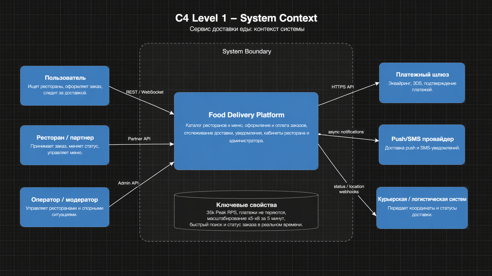
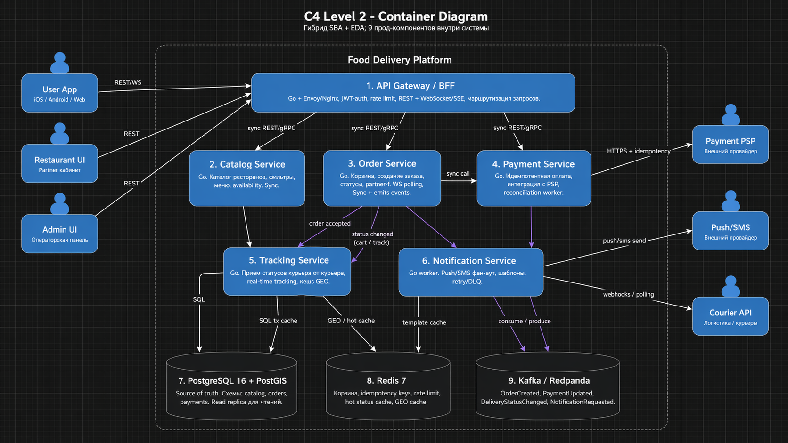
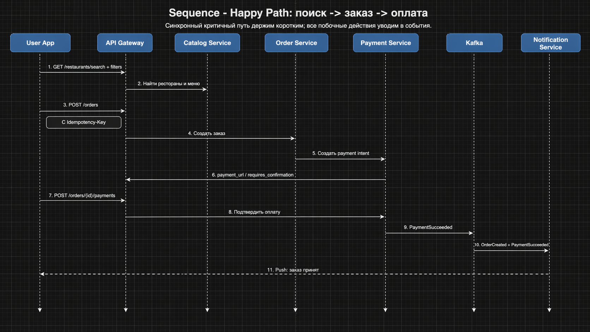
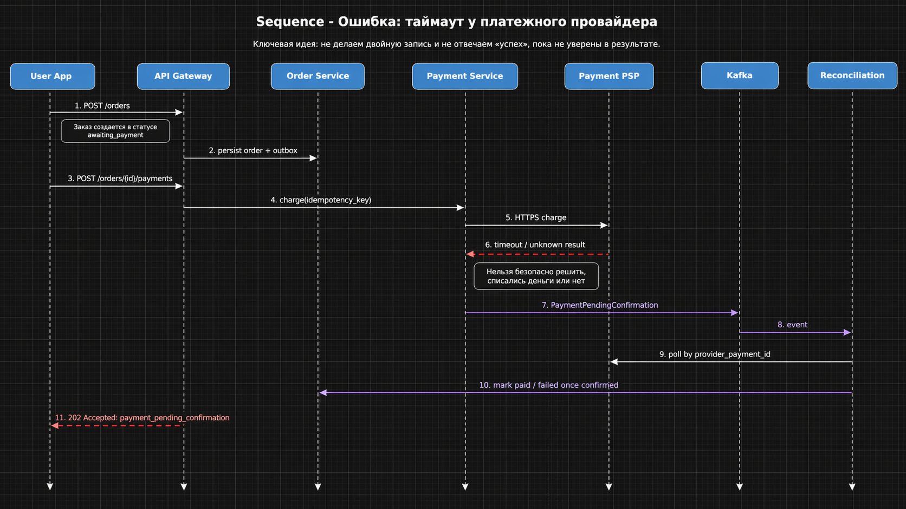
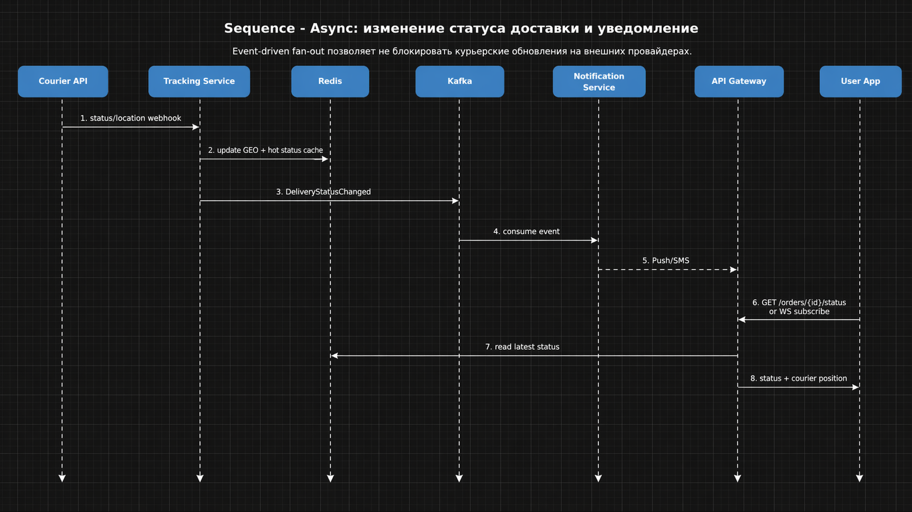

# Архитектура сервиса доставки еды
## 1. Архитектурный стиль и обоснование

### Выбранный стиль

Гибрид – Service-Based Architecture (SBA) с элементами Event-Driven Architecture (EDA).


### Обоснование

1. Скорость vs. Надёжность (НФТ-001, НФТ-004): SBA позволяет изолировать критичные сервисы (Оплата) с высокой доступностью, а EDA обеспечивает гарантированную доставку событий (заказ создан, оплата подтверждена) через брокер очередей, предотвращая потерю данных.

2. Бюджет и команда (Ограничения): Чистая микросервисная архитектура (MSA) слишком сложна для 5 человек и ограниченного бюджета. SBA позволяет иметь отдельные сервисы только для ключевых доменов (Оплата, Доставка), а менее критичные (Каталог, Корзина) могут быть в монолите или одном сервисе.

3. Пиковая нагрузка (НФТ-005, 35k RPS): EDA позволяет легко масштабировать асинхронных воркеров (например, отправку уведомлений), не блокируя основной поток оформления заказа. Stateless сервисы SBA легко горизонтально масштабируются за 5 минут под управлением оркестратора (K8s).


## 2. Компоненты и C4-диаграммы

### C4 Level 1 - System Context



Исходник: [`diagrams/c4-context.mmd`](diagrams/c4-context.mmd)

### C4 Level 2 - Container Diagram



Исходник: [`diagrams/c4-container.mmd`](diagrams/c4-container.mmd)

### Описание компонентов

| Компонент | Назначение | Технология |
|---|---|---|
| **API Gateway / BFF** | Единая внешняя точка входа: auth, rate limit, маршрутизация, REST + WebSocket/SSE для статусов | Go + Envoy/Nginx |
| **Catalog Service** | Поиск ресторанов, фильтры, меню, availability, ETA read-model | Go |
| **Order Service** | Корзина, создание заказа, изменение статуса заказа, partner API | Go |
| **Payment Service** | Создание payment intent, подтверждение оплаты, reconciliation, идемпотентность | Go |
| **Tracking Service** | Прием статусов и координат от логистики/курьеров, обновление hot state | Go |
| **Notification Service** | Отправка push/SMS, retry, DLQ, шаблоны сообщений | Go worker |
| **PostgreSQL 16 + PostGIS** | Source of truth для каталога, заказов и платежей | Managed PostgreSQL |
| **Redis 7** | Корзины, hot cache, GEO cache, rate limit, idempotency keys | Managed Redis |
| **Kafka / Redpanda** | Надежная доставка доменных событий и буферизация асинхронных сценариев | Kafka-compatible broker |

### Почему набор компонентов именно такой

- **Нет отдельного Search Engine на Day 1**: при ~20k ресторанов и ~1M позиций меню можно стартовать на PostgreSQL + PostGIS + `pg_trgm`, а не сразу тащить Elasticsearch.
- **Нет отдельного Cart Service**: корзина хранится в Redis, а бизнес-логика корзины живет в Order Service. Это дешевле и проще.
- **Tracking отделен от Order**: статусы и координаты приходят часто, а значит контур real-time лучше изолировать.
- **Notification отделен от write-path**: отправка SMS/push не должна удлинять p99 оформления заказа.

## 3. Sequence diagrams

### 3.1 Happy path - поиск -> заказ -> оплата



Исходник: [`diagrams/sequence-happy-path.mmd`](diagrams/sequence-happy-path.mmd)

Ключевая идея:

- внешний API синхронный и короткий;
- side effects уходят в события;
- клиент получает подтверждение сразу после фиксации результата, а не после отправки уведомлений.

### 3.2 Сценарий с ошибкой - таймаут PSP



Исходник: [`diagrams/sequence-payment-timeout.mmd`](diagrams/sequence-payment-timeout.mmd)

Ключевая идея:

- при таймауте внешнего PSP результат считается **unknown**, а не `success`/`failed` наугад;
- API отвечает `202 Accepted` со статусом `payment_pending_confirmation`;
- reconciliation worker потом дожимает итоговый статус.

Это помогает соблюдать требование «ничего не должно теряться» и не провоцировать двойное списание.

### 3.3 Асинхронный сценарий - статус доставки и уведомление



Исходник: [`diagrams/sequence-async-delivery-status.mmd`](diagrams/sequence-async-delivery-status.mmd)

Ключевая идея:

- обновления курьера сначала попадают в Tracking Service;
- горячее состояние и GEO-точка кладутся в Redis;
- fan-out уведомлений выполняется через Kafka и Notification Service.

## 4. API Design

### Подход к версионированию

- публичный API версионируется через URI: `/api/v1/...`;
- совместимые изменения - только additive;
- breaking changes - новая версия (`/api/v2/...`);
- на старые версии выставляются `Deprecation`/`Sunset` headers;
- для всех write-endpoints обязателен `X-Request-ID`, а для идемпотентных операций - `Idempotency-Key`.

---

### 4.1 `GET /api/v1/restaurants/search`

**Описание:** поиск ресторанов по названию, кухне, расстоянию, рейтингу и ETA.

**Request (query params):**

```http
GET /api/v1/restaurants/search?lat=55.75&lon=37.62&q=sushi&cuisine=japanese&sort=delivery_time&limit=20&offset=0
```

**Response 200:**

```json
{
  "items": [
    {
      "restaurant_id": "2d3d2f03-0bb0-4d6f-bde6-3ea3e6eb7a11",
      "name": "Sushi Town",
      "rating": 4.8,
      "eta_minutes": 34,
      "delivery_fee": 199,
      "distance_meters": 2300,
      "is_open": true
    }
  ],
  "total": 124,
  "limit": 20,
  "offset": 0
}
```

**Errors:**

- `400` - некорректные координаты / query params
- `401` - пользователь не авторизован
- `429` - rate limit exceeded
- `503` - каталог временно недоступен

---

### 4.2 `GET /api/v1/restaurants/{restaurant_id}/menu`

**Описание:** получить меню ресторана

**Response 200:**

```json
{
  "restaurant_id": "2d3d2f03-0bb0-4d6f-bde6-3ea3e6eb7a11",
  "name": "Sushi Town",
  "currency": "RUB",
  "items": [
    {
      "menu_item_id": "e4fd083f-321d-48d5-988c-77d5e981d18a",
      "name": "Филадельфия",
      "price": 549,
      "is_available": true,
      "category": "rolls"
    }
  ]
}
```

**Errors:**

- `404` - ресторан не найден
- `409` - ресторан временно закрыт
- `503` - сервис меню недоступен

---

### 4.3 `POST /api/v1/orders`

**Описание:** создать заказ из корзины.

**Headers:**

```http
Idempotency-Key: 0bf2f0ee-68c3-4b60-b0dc-ec9e4099f5ab
```

**Request:**

```json
{
  "restaurant_id": "2d3d2f03-0bb0-4d6f-bde6-3ea3e6eb7a11",
  "items": [
    {"menu_item_id": "e4fd083f-321d-48d5-988c-77d5e981d18a", "quantity": 2}
  ],
  "delivery_address": {
    "city": "Москва",
    "street": "Тверская, 1",
    "lat": 55.757,
    "lon": 37.615
  },
  "payment_method": "bank_card",
  "promo_code": "LUNCH10",
  "comment": "Позвонить за 5 минут"
}
```

**Response 201:**

```json
{
  "order_id": "8f1d409d-9498-4d0d-9a42-d94a3bdcb5ff",
  "status": "awaiting_payment",
  "total_amount": 1287,
  "currency": "RUB",
  "payment_required": true,
  "estimated_delivery_at": "2026-05-01T18:30:00Z"
}
```

**Errors:**

- `400` - невалидный request
- `404` - ресторан или блюдо не найдены
- `409` - ресторан закрыт / позиция недоступна / заказ уже создан по тому же idempotency key
- `422` - промокод невалиден
- `429` - слишком много запросов
- `503` - Order Service временно недоступен

---

### 4.4 `POST /api/v1/orders/{order_id}/payments`

**Описание:** провести оплату заказа.

**Headers:**

```http
Idempotency-Key: 50db7b64-daa0-4d48-8ff9-0b90f687bd3b
```

**Request:**

```json
{
  "payment_method": "bank_card",
  "payment_token": "tok_abc123",
  "return_url": "https://app.example/payments/return"
}
```

**Response 200:**

```json
{
  "payment_id": "e0ec7e71-8125-4f4a-9f2d-88c59dd67df9",
  "order_id": "8f1d409d-9498-4d0d-9a42-d94a3bdcb5ff",
  "status": "paid",
  "paid_at": "2026-05-01T17:55:12Z"
}
```

**Response 202 (таймаут PSP / статус неизвестен):**

```json
{
  "payment_id": "e0ec7e71-8125-4f4a-9f2d-88c59dd67df9",
  "order_id": "8f1d409d-9498-4d0d-9a42-d94a3bdcb5ff",
  "status": "payment_pending_confirmation"
}
```

**Errors:**

- `400` - невалидный request
- `404` - заказ не найден
- `409` - заказ уже оплачен / запрещенный переход статуса
- `422` - карта отклонена
- `503` - PSP или Payment Service временно недоступен

---

### 4.5 `GET /api/v1/orders/{order_id}/status`

**Описание:** получить текущий статус заказа и позицию курьера.

**Response 200:**

```json
{
  "order_id": "8f1d409d-9498-4d0d-9a42-d94a3bdcb5ff",
  "status": "courier_on_the_way",
  "eta_minutes": 12,
  "courier": {
    "lat": 55.744,
    "lon": 37.604,
    "updated_at": "2026-05-01T18:08:10Z"
  },
  "timeline": [
    {"status": "created", "at": "2026-05-01T17:48:09Z"},
    {"status": "paid", "at": "2026-05-01T17:55:12Z"},
    {"status": "accepted", "at": "2026-05-01T17:56:31Z"}
  ]
}
```

**Errors:**

- `401` - не авторизован
- `403` - заказ принадлежит другому пользователю
- `404` - заказ не найден
- `429` - rate limit exceeded
- `503` - статус временно недоступен

## 5. Выбор БД и модель данных

### 5.1 Выбор хранилищ

#### PostgreSQL 16 + PostGIS

**Почему:**

- ACID-транзакции для заказов и платежей;
- удобные связи `restaurant -> menu_item`,`order->menu_item`, `order -> payment`;
- geospatial поиск по координатам и зонам доставки;
- одна основная БД дешевле и проще в эксплуатации, чем набор узкоспециализированных хранилищ.
- Большие объемы информации

**Паттерн доступа:**

- критичные sync write'ы;
- чтение карточек ресторана и меню;
- partner/admin запросы с фильтрацией по статусу и времени.
- read реплики
#### Redis 7

**Почему:**

- очень быстрый доступ для корзины, статуса заказа и идемпотентности;
- TTL естественно подходит для сессионных данных и короткоживущих ключей;
- GEO помогает хранить последнюю точку курьера.

**Паттерн доступа:**

- миллисекундные чтения/записи;
- hot cache;
- rate limiting;
- временные ключи.

#### Kafka / Redpanda

**Почему:**

- надежная доставка событий между сервисами;
- decoupling Notification/Tracking от транзакционного write-path;
- возможность retry, replay и DLQ.

**Паттерн доступа:**

- append-only события;
- async fan-out;
- фоновые обработчики.

### 5.2 Основные сущности (3–5)

#### 1. `restaurants`

- **Store:** PostgreSQL (`catalog.restaurants`)
- **PK:** `restaurant_id UUID`
- **Основные поля:** `name`, `status`, `cuisine`, `rating`, `delivery_eta_min`, `location geography(Point,4326)`
- **Индексы:**
  - `PRIMARY KEY (restaurant_id)`
  - `GIN (name gin_trgm_ops)` - быстрый поиск по названию
  - `GiST (location)` - поиск по расстоянию
  - `BTREE (status, cuisine)` - фильтрация по кухне и доступности
- **Оценка объема:** ~20k записей на старте; ~22k через год

#### 2. `menu_items`

- **Store:** PostgreSQL (`catalog.menu_items`)
- **PK:** `menu_item_id UUID`
- **FK:** `restaurant_id -> restaurants.restaurant_id`
- **Основные поля:** `name`, `price`, `category`, `is_available`, `updated_at`
- **Индексы:**
  - `PRIMARY KEY (menu_item_id)`
  - `BTREE (restaurant_id, is_available)` - загрузка меню ресторана
  - `GIN (name gin_trgm_ops)` - поиск по блюдам при необходимости
- **Оценка объема:** ~1,000,000 записей (20k ресторанов * 50 позиций)

#### 3. `orders`

- **Store:** PostgreSQL (`orders.orders`)
- **PK:** `order_id UUID`
- **FK:** `user_id`, `restaurant_id`
- **Основные поля:** `status`, `total_amount`, `delivery_address_jsonb`, `payment_method`, `created_at`
- **Индексы:**
  - `PRIMARY KEY (order_id)`
  - `BTREE (user_id, created_at DESC)` - история заказов пользователя
  - `BTREE (restaurant_id, created_at DESC)` - заказы ресторана
  - `BTREE (status, created_at DESC)` - выборка активных заказов
  - партиционирование по месяцу `created_at`
- **Оценка объема:** планирование на **0.8–1.0 млн заказов/день**, то есть ~292–365 млн записей в год

#### 4. `order_items`

- **Store:** PostgreSQL (`orders.order_items`)
- **PK:** `(order_id, line_no)`
- **FK:** `order_id -> orders.order_id`, `menu_item_id -> menu_items.menu_item_id`
- **Основные поля:** `menu_item_id`, `quantity`, `price_snapshot`, `name_snapshot`
- **Индексы:**
  - `PRIMARY KEY (order_id, line_no)`
  - `BTREE (menu_item_id)` - аналитика и расследование инцидентов
- **Оценка объема:** при среднем чеке в 4 позиции - ~1.2–1.5 млрд строк в год

#### 5. `payments`

- **Store:** PostgreSQL (`payments.payments`)
- **PK:** `payment_id UUID`
- **FK:** `order_id -> orders.order_id`
- **Основные поля:** `status`, `provider`, `provider_payment_id`, `amount`, `attempt_no`, `idempotency_key`, `created_at`, `confirmed_at`
- **Индексы:**
  - `PRIMARY KEY (payment_id)`
  - `UNIQUE (idempotency_key)` - защита от дублей
  - `UNIQUE (provider, provider_payment_id)` - дедупликация callback/повторов
  - `BTREE (order_id, created_at DESC)` - все попытки по заказу
  - `BTREE (status, created_at DESC)` - reconciliation и support tooling
  - партиционирование по месяцу `created_at`
- **Оценка объема:** сопоставим с количеством заказов, в worst case до ~365 млн записей в год

### 5.3 Ключи в Redis

> В задание просили 3-5 основных сущностей, поэтому ниже - не full data model, а operational keys.

- `cart:{user_id}` - корзина пользователя, TTL 24 часа
- `idem:{idempotency_key}` - результат write-запроса, TTL 24 часа
- `order_status:{order_id}` - горячий статус заказа, TTL 1 час
- `courier_last_pos:{courier_id}` - последняя GEO-точка курьера, TTL 10 минут
- `rate_limit:{subject}` - счетчик лимита запросов, TTL 1 минута

## 6. ADR

- [ADR-001: гибрид SBA + EDA](adr/001-hybrid-sba-eda.md)
- [ADR-002: PostgreSQL + PostGIS на Day 1](adr/002-postgres-postgis-day1.md)
- [ADR-003: idempotency + transactional outbox](adr/003-idempotency-outbox.md)
