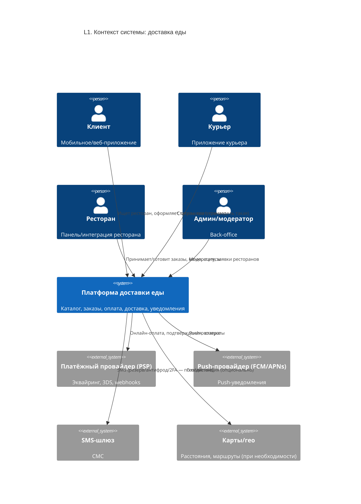
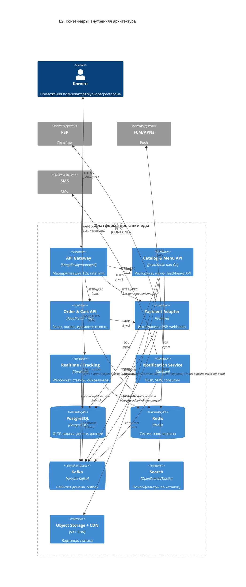

# Часть 1: Архитектура системы (сервис доставки еды)

> Контекст: `requirements.md` — доставка еды, пик, надёжность оплаты, 5–20 MAU, облако, ограниченный бюджет, команда ~5.

## Зафиксированный архитектурный стиль: гибрид (SBA + EDA, со слоистой организацией внутри сервисов)

**Состав:**

1. **Service-Based (SBA)** — небольшое, ограниченное число **отдельно деплоемых** сервисов с чёткими зонами ответственности (каталог, заказы, уведомления, трекинг). Снижает операционные затраты и подходит **команде ~5 человек** и **ограниченному бюджету** при целях по **Peak RPS / автомасштабированию**: масштабируются в первую очередь «горячие» контейнеры, а не десятки тонких MSA.
2. **Event-Driven (EDA)** — **жизненный цикл заказа, уведомления, интеграция с оплатой** строятся на **событиях в брокере** (outbox, идемпотентные обработчики, повторы). Это помогает требованию **«платёж/заказ ничего не терялось»** (durability) и **развязать** тяжёлые и медленные шаги от быстрого оформления.
3. **Layered (внутри сервиса)** — API → domain/application → infrastructure — чтобы **не переплачивать** за сложность, но оставить предсказуемую структуру кода.

**Почему не «чистые» MSA/только слоистая:** чистый MSA при ваших **НФТ и размере команды** чаще ведёт к росту стоимости владения; «один монолит без событий» — хуже с **пиковой нагрузкой, уведомлениями и гарантиями вокруг оплаты**. Гибрид **SBA+EDA** балансирует требования ТЗ (латентность оформления, надёжность денег, peak RPS, масштабирование за ~5 минут). Удобно вынести в **один из ADR (Часть 5)**.

---

## Компоненты (9 единиц «в прод») — назначение, стек, коммуникации

| # | Компонент | Назначение (1–2 предложения) | Технология | Коммуникация с другими |
|---|-----------|------------------------------|------------|-------------------------|
| 1 | **API Gateway** | Точка входа: TLS, маршрутизация, rate limiting, базовая аутентификация по токену, агрегация заголовков для внутренних вызовов. Снижает **hop'ы** и защищает backend от **пикового RPS**. | Kong / Envoy / managed API Gateway (облако) | **Sync:** HTTPS к клиентам; **sync:** HTTP/gRPC к backend; к брокеру — нет (только бизнес-сервисы) |
| 2 | **Catalog & Menu API** | Каталог ресторанов, меню, цены, доступность, контент; отдача **read-heavy** сценариев с кэшом; обновления меню/статуса ресторана. | **Java/Kotlin (Spring Boot)** или **Go**; отдельно поиск (п.9) | **Sync:** HTTP/gRPC от Gateway, чтение/запись в PG; **sync:** Redis; **async:** публикация событий в Kafka (например, «меню изменилось») |
| 3 | **Order & Cart API** | Корзина, оформление заказа, **идемпотентные** `order_id`/`Idempotency-Key`, state machine заказа, координация с рестораном; **outbox** в Kafka для гарантированной доставки событий. | **Java/Kotlin (Spring Boot)** + **PostgreSQL** (транзакции) | **Sync:** от Gateway; **sync:** PG, Redis; **async:** **Kafka** (события заказа); **sync:** вызовы Payment Adapter на этапе оплаты |
| 4 | **Payment Adapter** | Изоляция **эквайринга/агрегатора** (3DS, capture, refund), обработка **webhook** «статус платежа», маппинг на внутреннюю модель, строгая **аудит-запись** в БД. | **Go** или **Java**; интеграция по HTTP API банка | **Sync:** HTTP к PSP (внешний); **async:** **Kafka** (факты «оплата подтверждена/отклонена») и/или **async:** входящий webhook; **sync:** запись в PG |
| 5 | **Realtime (Tracking) Service** | **Статус заказа и курьер** (ФТ-005): WebSocket/Server-Sent Events, low-latency обновления; не блокирует OLTP, подписывается на **события/кэш**. | **Node.js/Go** + **WebSocket**; опционально **Redis** pub/sub | **Async:** **Kafka** / Redis pub-sub; **sync:** read из Redis кэша позиций; **sync:** WebSocket к мобильным/веб-клиентам |
| 6 | **Notification Service** | **Push / SMS** по событиям (принят, в пути, доставлен); повторы, dead-letter, соответствие **99.9%** для канала уведомлений. | **Go/Java** + провайдеры (FCM, SMS gateway) | **Async:** **Kafka** consumers; **sync:** внешние API push/SMS |
| 7 | **PostgreSQL (OLTP + outbox)** | **Источник правды** для заказов, платежей, профилей, ресторанов, адресов; **репликация**, бэкапы, строгая консистентность там, где **durability 99.99999%** для денег/заказа. | **PostgreSQL 15+**, Patroni / k8s operator | **Sync:** SQL от сервисов; **replication** между нодами (механизм БД) |
| 8 | **Redis** | Сессии/корзина, **кэш** каталога/меню, rate limit на ключах, **краткоживущие** данные для real-time, снижение p99 на read-операциях. | **Redis Cluster** / managed Redis | **Sync:** TCP/RESP от приложений |
| 9 | **Apache Kafka (кластер)** | **Буфер событий** для пиков, decoupling, **at-least-once** + идемпотентные consumer'ы; **outbox** из Order для «ничего не потерялось» после commit в PG. | **Kafka** (или совместимый Pulsar) | **Async:** продюсеры/консьюмеры сервисов; **replication** внутри кластера |
| 10 | **Object Storage + CDN** | **Фото блюд**, ститичные **ассеты** приложения; **низкая латентность** раздачи, разгрузка API и снижение исходящего **bandwidth** с origin. | S3-совместимое + **CloudFront/Cloudflare** | **Sync:** HTTPS GET клиентов к CDN; **async/sync:** upload из админ/рест-портала; origin — object storage |

*Если нужно **ровно 5–10** компонентов: объедините **Payment Adapter** с **Order API** (один «Order & Payment») и/или Realtime с Notification — по смыслу схема сохраняется.*

---

## C4 Level 1 — System Context

---

## C4 Level 2 — Container Diagram

---

## Связь с требованиями (кратко)

- **«Ничего не теряется» в оплате:** PostgreSQL + **outbox → Kafka** + идемпотентные обработчики и **webhook** к PSP.
- **Быстрое оформление:** Redis + кэш каталога; тяжёлая обработка — в **событиях**, не в синхронном пути.
- **Пик (35k RPS, масштаб 5–8× за 5 мин):** горизонтальный скейл stateless Gateway и API + кэш + брокер; БД — реплики (шардирование — запас на рост).
- **Команда 5, бюджет:** SBA+EDA вместо десятков микросервисов.
