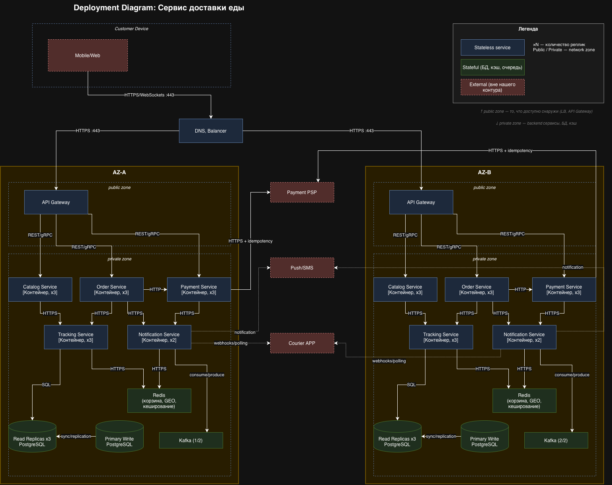

# Deployment Document: Сервис доставки еды (Food Delivery)

Документ описывает целевое production-развёртывание в соответствии с [архитектурой](architecture.md) и [требованиями](requirements.md). PoC в репозитории (Docker Compose: Nginx, catalog, order, PostgreSQL, Redis) покрывает подмножество сервисов; ниже - эксплуатационная модель полной системы.

---

## Часть 1. Deployment-документ

### 1.1. Описание развёртывания

#### Назначение

Платформа заказа и оплаты еды из ресторанов для миллионов MAU: каталог и меню, оформление заказа, оплата, статус доставки и уведомления. Целевая инфраструктура - **Yandex Cloud** (Managed Kubernetes): два AZ (**AZ-A**, **AZ-B**), глобальный **DNS + балансировщик** и **API Gateway** в public zone каждой зоны.

#### Нагрузка

Профиль из НФТ (`docs/requirements.md`), как договорённая цель capacity planning:

| Показатель | Значение |
|------------|----------|
| Средний RPS (вся система) | ~600 |
| Пиковый RPS (обед/ужин) | ~35 000 |
| Доля read/write | 85% / 15% |
| Критичные write-пики | оформление заказа ~2 100 RPS, оплата ~1 400 RPS (пик) |
| PoC (k6, см. [load-test-results.md](load-test-results.md)) | до ~1 322 RPS на ограниченном железе|

Пиковые сценарии: одновременный просмотр каталога и меню в 12:00-14:00 (обед) и 18:00-20:00 (ужин); кратковременные всплески на оплату при промо-акциях.

#### Deployment diagram

Исходник draw.io: [`diagrams/deployment-diagram.drawio`](diagrams/deployment-diagram.drawio).

На диаграмме: **AZ-A** и **AZ-B**, в каждой - **public zone** (API Gateway) и **private zone** (микросервисы, PostgreSQL, Redis, Kafka); глобальный **DNS, Balancer** распределяет трафик на оба AZ; внешние зависимости - **Payment PSP**, **Push/SMS**, **Courier APP** (красный пунктир).

#### Сервисы

| Сервис | Replicas (в каждом AZ) | Ответственность | Stateful / Stateless | Public / Private |
|--------|------------------------|-----------------|----------------------|------------------|
| Customer Device | - | Mobile / Web клиент | - | Вне контура |
| DNS, Balancer | 1 (глобально) | Маршрутизация на API Gateway в AZ-A и AZ-B | Stateless | **Public** |
| API Gateway | ×1 в public zone | AuthN/Z, rate limit, `X-Request-ID`, маршрутизация **REST/gRPC** к backend | Stateless | **Public** |
| Catalog Service | ×3 | Поиск ресторанов, меню, read-модель | Stateless | **Private** |
| Order Service | ×3 | Корзина (Redis), создание заказа, outbox | Stateless | **Private** |
| Payment Service | ×3 | Оплата, идемпотентность, reconciliation | Stateless | **Private** |
| Tracking Service | ×3 | Статусы и координаты курьера, hot state | Stateless | **Private** |
| Notification Service | ×2 | Push/SMS, consume/produce Kafka | Stateless | **Private** |
| PostgreSQL Primary Write | ×1 (в обеих AZ) | Запись заказов, платежей, каталога, outbox | **Stateful** | **Private** |
| PostgreSQL Read Replicas | ×3 (в обеих AZ) | Чтение, разгрузка write-primary | **Stateful** | **Private** |
| Redis | 1 логический кластер | Корзина, GEO, кеширование | **Stateful** | **Private** |
| Kafka | ×1 (в обеих AZ) | Асинхронные события, fan-out уведомлений | **Stateful** | **Private** |
| Payment PSP | - | Внешний платёжный провайдер | External | Вне контура |
| Push/SMS | - | Провайдер уведомлений | External | Вне контура |
| Courier APP | - | Приложение курьера / логистика | External | Вне контура |

#### Адресация и порты

| Назначение | FQDN / имя | Порт |
|------------|------------|------|
| Публичный API | `api.<product>.ru` → DNS/Balancer → API Gateway | **443** (HTTPS / WebSocket) |
| Внутри кластера | `catalog.food-delivery.svc.cluster.local`, `order.food-delivery.svc.cluster.local`, … | согласованные service ports (REST/gRPC) |
| PostgreSQL (managed) | primary / replica endpoints в VPC | **6432** (TLS) |
| Redis | приватный endpoint | **6379** (HTTPS) |
| Kafka | bootstrap в VPC | **9092** |

**Сеть:** VPC `10.0.0.0/16`; подсети по AZ: `10.1.0.0/24` (AZ-A), `10.1.1.0/24` (AZ-B). **Static IP:** VIP балансировщика/DNS — фиксированный для клиентов и интеграций; IP подов - не фиксируем.

---

### 1.2. Стратегия деплоя

#### Общие принципы zero-downtime

- **Readiness:** HTTP GET `/ready` (или `/health` с проверкой БД/Redis) - успех только если пул соединений и зависимости доступны; readiness failure → трафик не направляется на под.
- **Liveness:** `/live` без тяжёлых зависимостей - детект зависших процессов, рестарт пода.
- **Graceful shutdown:** `terminationGracePeriodSeconds` ≥ 30s; на `SIGTERM` прекращение приёма новых запросов, drain in-flight, закрытие соединений к БД/Redis, завершение outbox-публикации в пределах окна.

#### По ключевым сервисам

| Сервис | Стратегия | Почему |
|--------|------------|--------|
| **catalog-service**, **order-service**, **tracking-service**, **notification-service** | **RollingUpdate** (maxUnavailable=0, maxSurge=1) | Stateless; Rolling даёт непрерывность при репликах в **AZ-A** и **AZ-B**. |
| **API Gateway** | **RollingUpdate** | Edge в public zone; критично держать min реплик в обеих зонах, пока DNS/Balancer направляет трафик. |
| **payment-service** | **Canary** (10% → 50% → 100% по метрикам ошибок/latency) | Денежный контур и интеграции с PSP; снижаем blast radius при регрессии. |
| **Managed PostgreSQL / Redis / Kafka** | Управляемые rolling-maintenance YC + окна (см. часть 2) | Не Kubernetes Deployment; версии и патчи - по runbook провайдера. |

#### Миграции БД

Используем **Expand/Contract** для изменений схемы под нагрузкой:

1. **Expand:** добавить новый столбец/таблицу/индекс CONCURRENTLY, dual-write или backfill в фоне; приложение читает старое+новое.
2. **Переключение:** перевести чтение/запись на новую схему фичефлагом.
3. **Contract:** удалить старое поле/таблицу после стабилизации.

Для «только добавили nullable столбец» - упрощённый expand. Тяжёлые DDL только в maintenance window или через online-инструменты managed PostgreSQL.

Outbox и идемпотентность ([ADR-003](adr/003-idempotency-outbox.md)) остаются совместимыми: миграции не ломают уникальные ключи и порядок публикации без двухфазного согласования с воркером.

---

### 1.3. Observability

#### Алерты

Critical path: **клиент → DNS/Balancer → API Gateway → order/catalog → PostgreSQL/Redis** и **оплата → payment → PSP / PostgreSQL**.

| Сигнал | Метрика | Порог (пример) | Окно | На что смотреть |
|--------|---------|----------------|------|------------------|
| **Latency** | p99 latency HTTP `POST /api/v1/orders` (с API Gateway) | > 1.3 s | 5 мин скользящее | **order-service** + **API Gateway** |
| **Errors** | Доля HTTP 5xx на `POST /api/v1/orders/{id}/payments` | > 0.1% от успешных попыток | 5 мин | **payment-service** |
| **Traffic** | RPS на API Gateway (все маршруты) | < 200 RPS при ожидаемом пике (аномальное падение) **или** резкий ноль | 10 мин | **API Gateway** / DNS/Balancer |
| **Saturation** | PostgreSQL Primary: CPU **или** доля соединений `active/total` | > 80% | 5 мин | **PostgreSQL Primary Write** (write-path) |

*Traffic-алерт на «слишком низкий RPS» калибруется под сезон и маркетинг; альтернатива - saturation по **Redis memory** для корзины.*

#### Дашборды

| Уровень | Содержание |
|---------|------------|
| **Overview** | Один экран: суммарный RPS, p95/p99 latency по золотому пути (search, create order, pay), error rate 4xx/5xx, CPU/RAM нод кластера, lag Kafka consumer groups, replication lag PostgreSQL. |
| **Service-level** | **RED** по каждому сервису: rate (RPS), errors (%), duration (histogram); отдельные панели для catalog, order, payment, tracking, notification. |
| **Diagnostic** | **USE** по ресурсам: CPU/memory/disk I/O нод и подов; connection pool к БД; Redis hit rate / evictions; Kafka broker disk; **traces** (trace_id) по конкретному запросу для расследования. |

#### Логи

| Аспект | Решение |
|--------|---------|
| **Формат** | **JSON в stdout** - парсинг в Yandex Cloud Logging без кастомных парсеров, удобная фильтрация. |
| **Обязательные поля** | `timestamp` (RFC3339), `level`, `service`, `trace_id`, `span_id` (если есть), `method`, `path`, `http_status`, `duration_ms`, `msg` |
| **Логируем** | Входящий запрос (без тела с PII), исходящий вызов к PSP/каталогу (URL + latency + status), бизнес-события уровня `order_created`, ошибки с **stack trace** в отдельном поле |
| **Не логируем** | PAN/CVV, полные платёжные токены, пароли, адрес целиком без маскировки, `Idempotency-Key` в связке с суммой в открытом виде в публичных логах - минимизировать PII и секреты |

---

## Часть 2. Доступность

### Целевая доступность системы

**Цель для пользовательского контура «заказ + статус»:** **99.9%** (~43 мин простоя в месяц).

**Обоснование:** в [requirements.md](requirements.md) для оплаты задано 99.99%, для каталога/поиска - 99.5%. Единая цифра «99.9%» для всей системы - компромисс: простой каталога на минуты не обнуляет выручку так, как простой оплаты, но пользователи ожидают стабильного приложения в пик. Ориентир по деньгам: при обороте порядка **100 млн руб/день** каждая минута простоя критичного контура ≈ **~70 тыс руб** недополученной выручки (очень грубо, без учёта компенсаций); **99.9%** ограничивает ожидаемый «видимый» простой до приемлемого для продукта уровня при ограниченном бюджете команды из 5 человек.

Для **оплаты** внутри SLO остаётся более жёсткая цель **99.99%** (отдельный SLO и алерты на payment + БД платежей).

### RPO / RTO

| Компонент | RPO | RTO | Комментарий |
|-----------|-----|-----|-------------|
| **PostgreSQL** (Primary Write + Read Replicas ×3) | ≤ 5 мин на read-replica при async; запись на primary - **~0** при sync replication | ≤ 30 мин (promote replica / failover primary) | На диаграмме: primary в AZ-A, реплики в обеих AZ; бэкапы + PITR managed. |
| **Kafka** | 0 для acked producer writes при `acks=all` и репликацией | ≤ 15 мин | Очередь событий; после восстановления - replay с offset. |
| **Redis** (корзина, hot status) | **5–15 мин** (снимок RDB + AOF по политике) - **допустима потеря несохранённой в PG корзины** | ≤ 10 мин | Не система записи для денег; критичные данные уже в PostgreSQL. |

### Резервирование и геораспределённость

| Компонент | Стратегия |
|-----------|-----------|
| **PostgreSQL** | **Primary Write** (AZ-A) + **Read Replicas ×3** - active/standby для записи, active/active для чтения; failover primary в регионе. Гео-DR - **Day 2**. |
| **Kafka** | **Active/active**: брокер **(1/2)** в AZ-A, **(2/2)** в AZ-B; репликация партиций. |
| **Redis** | Один HA-кластер в private zone (корзина, GEO, кеш); доступ с Tracking и Notification. |
| **Stateless сервисы** | Реплики в **AZ-A** и **AZ-B** за DNS/Balancer - **active/active**. |

### Maintenance window

- **Есть:** ночное окно **02:00-05:00 МСК**, не чаще **2 раз в месяц** для тяжёлых миграций БД и обновлений major версий Kafka/Redis.
- **Без окна:** rolling деплой приложений в рабочее время при соблюдении canary для payment.
- Критичные security-патчи managed - по графику провайдера с уведомлением; по возможности переносим в то же ночное окно.

---

## Часть 3. TCO в Yandex Cloud

Оценка по модели из [архитектуры](architecture.md) и маппингу на сервисы YC. **Базовый сценарий** - суммы из [калькулятора Yandex Cloud](https://yandex.cloud/ru/prices) (регион **ru-central1**, конфигурации ниже). Сценарии **2×** и **5×** - экстраполяция масштабирования (отдельный прогон калькулятора или увеличение vCPU/диска/числа нод по строкам).

### Допущения для текущей целевой нагрузки (~600 RPS ср., пик до ~35k)

- **Managed Kubernetes:** Высокодоступный, 6 worker-нод (2 vCPU, 8 ГБ RAM, 64 HDD), **2 AZ**.
- **Managed PostgreSQL:** primary + 3 read replica, AMD Zen 4 класс **s4a-c2-m8** (2 vCPU, 8 ГБ RAM), SSD 500 ГБ.
- **Managed Redis:** HA, ~16 ГБ RAM (корзина, GEO, кеш).
- **Managed Kafka:** **2 брокера** (партиции 1/2 и 2/2 по AZ), AMD Zen 4 класс **s4a-c2-m8** (2 vCPU, 8 ГБ RAM), SSD 32 ГБ.
- **DNS + Application Load Balancer** (глобальный вход на API Gateway в обеих зонах).
- **Monitoring + Logging:** ~50 ГБ логов/мес, стандартные метрики MKS - **оценка** (в калькуляторе отдельной строкой не выставлялось).
- **Сетевой трафик:** исходящий к PSP и клиентам - заложен в строку Monitoring / трафик (оценка).

### Таблица расчётов (тыс руб/мес)

| Статья | База (калькулятор) | Рост **2×** трафика | Рост **5×** трафика |
|--------|-------------------|---------------------|---------------------|
| Managed Kubernetes | 65 | 85 | 190 |
| Managed PostgreSQL (primary + 3 replica, s4a-c2-m8, 500 ГБ SSD) | 55 | 95 | 175 |
| Managed Redis (HA, 16 ГБ) | 10 | 20 | 50 |
| Managed Kafka (2 × s4a-c2-m8, 32 ГБ SSD) | 25 | 40 | 85 |
| DNS + ALB + публичные IP | 5 | 8 | 12 |
| Диски брокеров Kafka / Cloud Logging | 5 | 8 | 15 |
| Monitoring + сетевой трафик *(оценка)* | 15 | 22 | 35 |
| **Итого инфраструктура** | **180** | **278** | **562** |

*Сумма базы: 65 + 55 + 10 + 25 + 5 + 5 + 15 = **180** тыс ₽/мес.*

**Как получены 2× / 5×:** увеличение worker-нод MKS и класса PostgreSQL; Redis - рост RAM (16 → 32 → 64 ГБ); Kafka - больший диск и при 5× третий брокер или s4a-c4-m16; ALB и логи растут слабее (~×1,6 и ~×2,3); monitoring/трафик - ~×1,5 и ~×2,3.

### Операционные затраты (оценка / мес)

| Статья | Оценка |
|--------|--------|
| On-call + инциденты (доля FTE команды 5 чел.) | 80-150 тыс руб/мес эквивалентом времени |
| Регулярное обслуживание (релизы, runbooks, тесты DR) | 40-80 тыс руб/мес |
| **Всего OpEx ** | **120-230 тыс руб/мес** |

### Что дороже всего и почему

1. **Managed Kubernetes (65 тыс руб/мес, ~36% базы)** - шесть worker-нод в HA-кластере на двух AZ; основной compute под Catalog/Order/Payment/Tracking/Notification.  
2. **Managed PostgreSQL (55 тыс руб/мес, ~31%)** - primary + три read replica на `s4a-c2-m8`, диск 500 ГБ; самая дорогая stateful-часть по данным заказов и outbox.  
3. **Managed Kafka (25 тыс руб/мес, ~14%)** - два брокера в разных AZ; при **5×** может обогнать Redis из-за диска и дополнительного брокера.

**Итого с OpEx:** инфраструктура **~180** + операционные **~120-230** ≈ **~300-410** тыс руб/мес (база); при **5×** трафика  **~562** + OpEx.

---

## Связанные материалы

- [architecture.md](architecture.md) - C4, API, данные  
- [requirements.md](requirements.md) - НФТ, RPS, доступность  
- [load-test-results.md](load-test-results.md) - PoC и k6  
